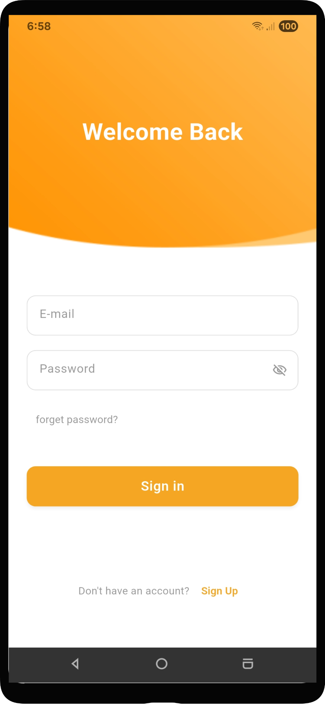
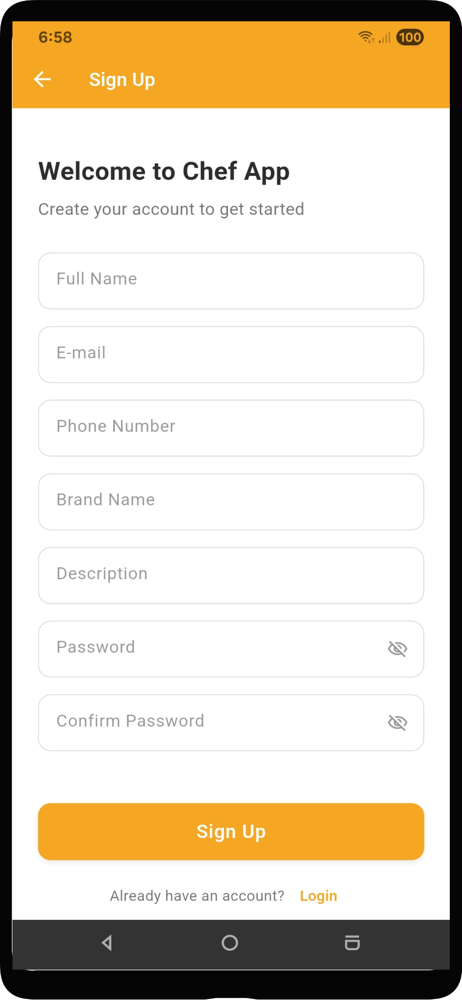
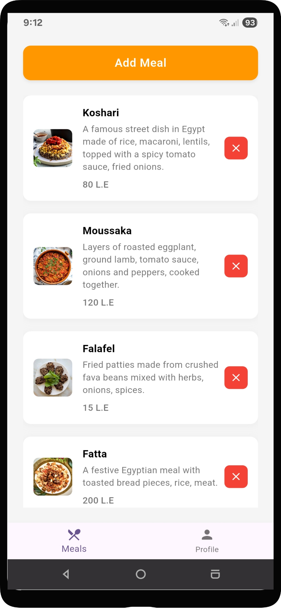
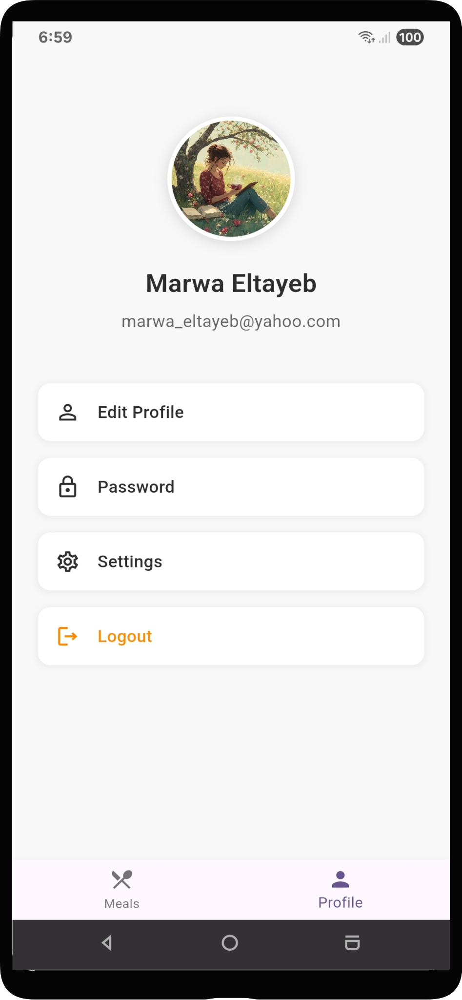
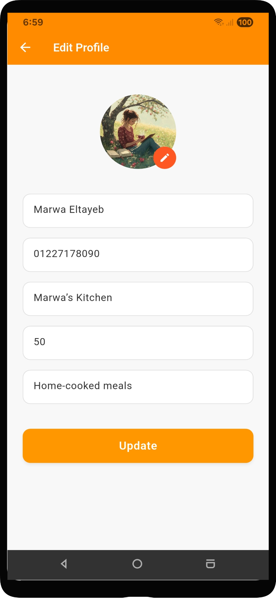
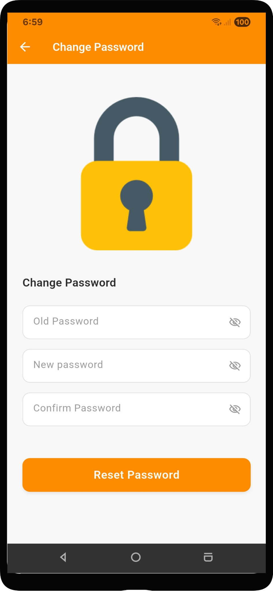

# 👨‍🍳 Chef App

A production-ready Flutter application for chefs to manage their meals, menus, and business operations. Built with Clean Architecture and modern Flutter best practices.

## 📋 Overview

Chef App is a complete meal management system that helps chefs organize their culinary business. The app features secure authentication, meal CRUD operations with image uploads, profile management, and full bilingual support (English & Arabic). Built with Supabase backend and following clean architecture principles for maintainability and scalability.

## 🛠️ Tech Stack

- **Flutter** – Cross-platform mobile framework.
- **Supabase** – Backend (Auth, Database, Storage).
- **flutter_bloc (Cubit)** – State management.
- **get_it** – Dependency injection.
- **go_router** – Navigation and deep linking.
- **easy_localization** – Multi-language support.
- **dio** – HTTP client for REST API communication.
- **pretty_dio_logger** – Logging for Dio requests.
- **image_picker** – Camera and gallery access.
- **flutter_native_splash** – Native splash screen generation.
- **shared_preferences** – Local key-value storage.
- **flutter_dotenv** – Environment variable management.
- **app_links** – Deep linking support.
- **sentry_flutter** – Error tracking and monitoring.

## 🏗️ Architecture

The app follows **Clean Architecture** with feature-first organization:

```
lib/
├── 📱 app/                  # App-level configs
│   ├── localization/        # Language setup
│   └── router/              # Navigation routes
│
├── 🎯 core/                # Shared utilities
│   ├── constants/           # Assets, strings, constants
│   ├── di/                  # Dependency injection
│   ├── utils/               # Validators, helpers
│   └── widgets/             # Reusable UI components
│
└── ✨ features/            # Feature modules
    ├── 🔐 auth/            # Authentication
    │   ├── data/            
    │   ├── domain/          
    │   └── presentation/    
    │
    ├── 🍽️ meal/             # Meal Management
    │   ├── data/
    │   ├── domain/
    │   └── presentation/
    │
    ├── 👤 profile/           # User Profile
    │   ├── data/
    │   ├── domain/
    │   └── presentation/
    │
    └── 🌍 language/          # Language Selection

```

Each feature follows **3-layer architecture**:
- **Data Layer**: Supabase integration, models, repository implementations
- **Domain Layer**: Entities, repository contracts, use cases, validators
- **Presentation Layer**: Cubit state management, screens, widgets

## ✨ Features

### 🔐 Authentication
- User registration and login
- Email-based password recovery
- Password reset via deep link (`myapp://reset-password`)
- Change password for logged-in users
- Session management with Supabase Auth

### 🍽️ Meal Management
- Create meals with images and details
- Browse all meals
- Edit existing meals
- Delete meals
- Upload meal photos to cloud storage
- Category selection dropdown

### 👤 Profile Management
- View and edit profile information
- Update profile picture
- Change password
- Settings and preferences

### 🌍 Internationalization
- Full bilingual support (English & Arabic)
- RTL layout for Arabic
- Persistent language selection
- Easy language switching

### 🔗 Deep Linking
- Universal links for password reset
- Custom URL scheme: `myapp://`
- mail-to-app navigation

## 📸 Screenshots
<p align="center">
  
  
  
</p>

<p align="center">
  
  
  
</p>

## 👤 Author

- GitHub: [@marwa-eltayeb](https://github.com/marwa-eltayeb)


